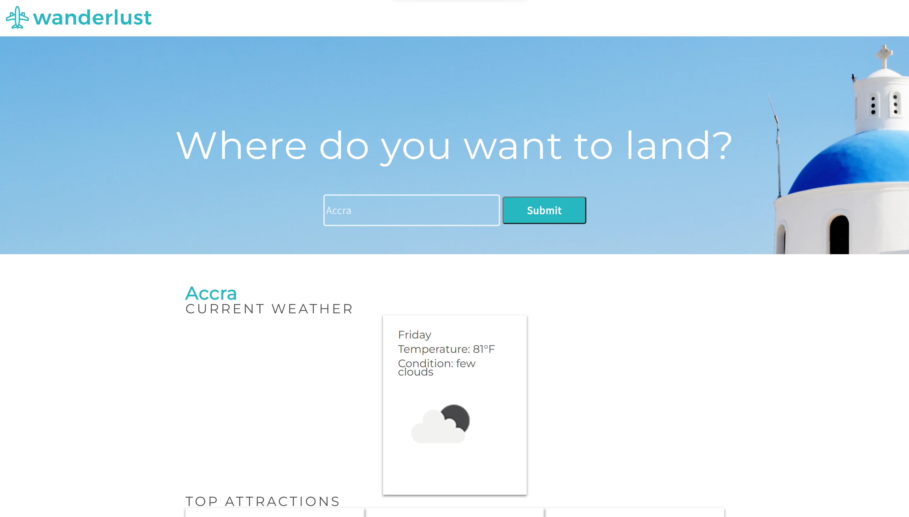

# Wanderlust

A website built with HTML, CSS and Javascript 

## Table of contents

* [General info](#general-info)
* [Screenshot](#screenshot)
* [Technologies](#technologies)
* [Languages](#languages)
* [Features](#features)
* [Inspiration](#inspiration)

## General info

 This is a challenge project set as part of the Codecademy Back-End Engineer career path course.
## Screenshot

## Technologies

* HTML
* CSS
* AJAX

## Languages

* JavaScript

## Status

Project is: _COMPLETE_

## Inspiration

Project created as part of Codecademy Full-Stack Engineer career pathway.

